# **Data Lake, Data Governance e a LGPD**
#### Autores: Cristiano dos Santos Fortunato, Elaine Fabíola Soares e Jaime Ranulfo Leite Filho 
#### Disciplina Processamento Massivo de Dados - Profa. Dra. Sahudy Montenegro Gonzalez
#### Departamento de Computação (DComp) - Janeiro/2021 
#### Universidade Federal de São Carlos (UFSCar)
#### 18052-780, Sorocaba, São Paulo, Brasil

## Resumo

Há muito tempo as empresas utilizam dados como a matéria prima para
executar diversas atividades, mas será que extraem desses dados informações
relevantes para a manutenção do seu negócio? Em um mundo onde, cada vez mais,
a informação é algo que diferencia o modelo de negócio, entender como criar uma
cultura baseada em dados é algo mandatório para o sucesso corporativo. Sendo
assim, conhecer um caminho de implementação de uma arquitetura de extração de
informação é extremamente importante no contexto atual. Levando em conta que
existem diversas abordagens que podem ser seguidas, neste trabalho é
apresentada uma forma de criação de conhecimento à partir de dados.
O trabalho tem início na definição de conceitos fundamentais como governança 
de dados e LGPD, explora modelos de arquitetura conceituais para se obter informações 
à partir das massas de dados como por exemplo Data Lake e Big Data abordando características dessas
tecnologias e o porque dessas escolhas e, finalmente toca em questões como
dados sensíveis e segurança de dados que são importantíssimas e estão em alta no
mundo da informação, fechando o ciclo necessário para implementação desse tipo
de abordagem.

**Palavras-chave:** DataLake. Big Data. LGPD. Governança de Dados.

## Sumário

* [1. Introdução](https://github.com/elainefabiola/datalake/blob/main/README.md#1-introducao)
  * [1.1 Motivação](https://github.com/elainefabiola/datalake/blob/main/README.md#11-motiva%C3%A7%C3%A3o)
  * [1.2 Objetivos](https://github.com/elainefabiola/datalake/blob/main/README.md#12-objetivo)
  * [1.3 Justificativa](https://github.com/elainefabiola/datalake/blob/main/README.md#13-justificativa)
  * [1.4 Estrutura do Trabalho](https://github.com/elainefabiola/datalake/blob/main/README.md#14-estrutura-do-trabalho)
* [2. Governança de Dados](https://github.com/elainefabiola/datalake/blob/main/README.md#2-governan%C3%A7a-de-dados)
  * [2.1 Como promover a Governança de Dados](https://github.com/elainefabiola/datalake/blob/main/README.md#21-como-promover-a-governan%C3%A7a-de-dados)
  * [2.2 Definição do comitê Gestor](https://github.com/elainefabiola/datalake/blob/main/README.md#22-defini%C3%A7%C3%A3o-do-comit%C3%AA-gestor)
* [3. Lei  Geral  de  Proteção  de  Dados  Pessoais  (LGPD  –  Lei  n°  13.709)](https://github.com/elainefabiola/datalake/blob/main/README.md#3-lei-geral-de-prote%C3%A7%C3%A3o-de-dados-lgpd)
  * [3.1 O que norteia a LGPD ?](https://github.com/elainefabiola/datalake/blob/main/README.md#31-o-que-norteia-a-lgpd-)
  * [3.2 Dado pessoal](https://github.com/elainefabiola/datalake/blob/main/README.md#32-dado-pessoal)
  * [3.3 Direitos garantidos aos titulares de dados](https://github.com/elainefabiola/datalake/blob/main/README.md#33-direitos-garantidos-aos-titulares-de-dados)
  * [3.4 Como realizar o tratamento dos dados pessoais ?](https://github.com/elainefabiola/datalake/blob/main/README.md#34-como-realizar-o-tratamento-dos-dados-pessoais-)
  * [3.5 Relatório de Impacto à Proteção dos Dados Pessoais (RIPD)](https://github.com/elainefabiola/datalake/blob/main/README.md#35-relat%C3%B3rio-de-impacto-%C3%A0-prote%C3%A7%C3%A3o-dos-dados-pessoais-ripd)
 * [4. O Datalake](https://github.com/elainefabiola/datalake/blob/main/README.md#-4-o-data-lake)
   * [4.1 Origem do Termo](https://github.com/elainefabiola/datalake/blob/main/README.md#41-origem-do-termo)
   * [4.2 Arquitetura de referência do Data Lake](https://github.com/elainefabiola/datalake/blob/main/README.md#-42-arquitetura-de-refer%C3%AAncia)
   * [4.3 Arquitetura de processamento de dados em larga escala](https://github.com/elainefabiola/datalake/blob/main/README.md#43-arquitetura-de-processamento-de-dados-em-larga-escala)
   * [4.4 Os pilares de uma arquitetura de processamento de dados em larga escala](https://github.com/elainefabiola/datalake/blob/main/README.md#44-os-pilares-de-uma-arquitetura-de-processamento-de-dados-em-larga-escala)
   * [4.5 Arquitetura de Big Data](https://github.com/elainefabiola/datalake/blob/main/README.md#45-arquitetura-de-big-data)
   * [4.6 Big Data vs. Data Lake](https://github.com/elainefabiola/datalake/blob/main/README.md#46-big-data-vs-data-lake)
   * [4.7 Cultura Data Driven](https://github.com/elainefabiola/datalake/blob/main/README.md#47-cultura-data-driven) 
* [5. LGPD e Governança no contexto de um Data Lake](https://github.com/elainefabiola/datalake/blob/main/README.md#5-lgpd-e-governan%C3%A7a-no-contexto-de-um-data-lake)
   * [5.1 Governança vs. Data Lake](https://github.com/elainefabiola/datalake/blob/main/README.md#51-governan%C3%A7a-vs-data-lake)
   * [5.2 LGPD vs. Data Lake](https://github.com/elainefabiola/datalake/blob/main/README.md#52-lgpd-vs-data-lake)
* [6. Conclusões](https://github.com/elainefabiola/datalake/blob/main/README.md#6-conclus%C3%A3o)
* [Contribuições e Trabalhos Futuros](https://github.com/elainefabiola/datalake/blob/main/README.md#contribui%C3%A7%C3%B5es-e-trabalhos-futuros)
* [Referências](https://github.com/elainefabiola/datalake/blob/main/README.md#refer%C3%AAncias)

    

## 1. Introducao

Em 2017, o jornal The Economist publicou uma história com o título “O
recurso mais vailoso não é mais petróleo, mas dados” (do original em inglês “The
world most valuable resource is no longer oil, but data”) exemplificando a relevância
que o dado tem na economia global. Nos últimos anos, algumas empresas surgiram
e se tornaram as grandes causadoras de disrrupção de modelos de negócios
estabelecidos à anos, simplesmente porque tinham uma estratégia de negócio
direcionada à dados [(THE ECONOMIST, 2017)](https://www.economist.com/leaders/2017/05/06/the-worlds-most-valuable-resource-is-no-longer-oil-but-data).

No movimento contrário às empresas que nasceram e transformaram o
mercado, outras empresas quebraram pelo simples fato de não conseguir concorrer
com as entrantes modernas e, em alguns casos, o motivo pode ser porque seu
modelo de negócio estava solidificado em uma base que não usufruía dos dados à
disposição para tomar decisões, tornando o negócio pouco eficiente, ou muitas
vezes, nada rentável. À exemplo da Amazon, varejista americana que está
transformando o mercado de compras na última década está quebrando empresas
como Macy’s e Sears, além de ser a responsável por fechar cerca 9100 lojas nos
Estados Unidos no ano de 2019 [(CIMENT, 2019)](https://www.businessinsider.com/shopping-changed-last-decade-amazon-death-of-malls-2019-11).

Mesmo em situações onde os dados não são a principal fonte de receita,
uma cultura de gestão voltada à dados já é algo imperativo para a manutenção da
competitividade dessa empresa no mercado atual, pois uma cultura orientada à
dados permite que os processos de tomada de decisão sejam menos empíricos
trazendo, em geral, mais assertividade nas decisões tomadas.

## 1.1 Motivação

Entender e estruturar toda a cadeia de processamento pela qual o dado
deve passar dentro de uma empresa é uma tarefa extremamente complexa que exige
uma série de conhecimentos multidisciplinares como coleta, armazenamento, gestão
de dados, segurança, governança, LGPD e até mesmo negócio e, vivenciando o mercado
de tecnologia sob a ótica de implementador de sistemas de Big Data e o conceito de Data Lake, percebe-se
uma série de conceitos incorretos inseridos em reuniões e discussões quando a
pauta tende à dados.

## 1.2 Objetivo

O desafio faz-se em estruturar um caminho de conhecimento a ser adquirido
por profissionais em fase inicial de aprendizado, mostrando os principais conceitos
acerca da disciplina de dados e informação com exemplos práticos e cotidianos,
sem entrar em questões que exijam um extremo conhecimento histórico em
tecnologia, dando um guia simples de conhecimento que balize as decisões no nível
macro. Por fim, a proposta é ter um trabalho com informações modernas e
relevantes para que pessoas na camada de gestão se sintam confortáveis em falar
minimamente sobre esta disciplina que está tão em voga e ainda possui pouco
domínio em nível executivo.

## 1.3 Justificativa

Gerentes, diretores e C-levels (ex: CIO e CEO), em geral, não possuem
conhecimento para tomar as decisões necessárias e a grande maioria das fontes de
informações é extremamente técnica e pouco elucidativa para pessoas em cadeiras
de gestão, tornando o ganho de conhecimento algo extremamente penoso e
desmotivador. Esses profissionais, mesmo quando assessorados por membros técnicos de
suas respectivas equipes sentem dificuldade em entender os conceitos e os por
quês de algumas decisões, se sentindo inseguros de levar estratégias de adoções
de dados adiante, o que como já vimos, pode ser algo ruim para a continuidade da
empresa.

## 1.4 Estrutura do Trabalho

No Capítulo 1 encontramos as motivações para fazer o trabalho, o objetivo
para o qual o trabalho se presta e a justificativa de tê-lo feito.

Nos Capítulos 2 e 3 a governança e segurança de dados são a pauta principal,
passando pelas principais leis de regulação existentes atualmente e as disciplinas
de gestão de dados defendidas pelo Data Managment Body of Knowledge
(DMBOK).

No Capítulo 4 o conceito de Data Lake é amplamente discutido, junto com as
suas características e formas de processamento, seguido por uma
arquitetura de referência e a abordagem do conceito da cultura DATA DRIVEN.

No Capítulo 5 os conceitos de LGPD e Governança são discutidos no contexto de um Data Lake.

Finalizando o trabalho, no Capítulo 6, são apresentadas as conclusões.

## 2. Governança de Dados 
### 2.1 Como promover a Governança de Dados

O sucesso da Governança Dados deve-se ao alinhamento com os princípios básicos da Governança Corporativa, com o patrocínio dos principais executivos e envolvimento de todas as pessoas da organização, indistintamente, pois todos, de alguma forma produz ou manipula os dados.

**Governança Corporativa**

Governança corporativa é o sistema pelo qual as empresas e demais organizações são dirigidas, monitoradas e incentivadas, envolvendo os relacionamentos entre sócios, conselho de administração, diretoria, órgãos de fiscalização e controle e demais partes interessadas, Instituto Brasileiro de Governança Corporativa, [(IBGC, 2020)](<https://www.ibgc.org.br/conhecimento/governanca-corporativa>), ainda segundo o [(IBGC, 2020)](<https://www.ibgc.org.br/conhecimento/governanca-corporativa>), as boas práticas de governança corporativa convertem princípios básicos em recomendações objetivas, alinhando interesses com a finalidade de preservar e otimizar o valor econômico de longo prazo da organização, facilitando seu acesso a recursos e contribuindo para a qualidade da gestão da organização, sua longevidade e o bem comum.

Para exemplificar, abaixo vamos apresentar um modelo de Governança, escolhemos o Itaú Unibanco Participações, [(IUPAR - 2020)](<https://www.itau.com.br/relacoes-com-investidores/show.aspx?idCanal=vwRz5Vohb4ufKQ5nOZ68dw==&linguagem=pt>)

Segundo [(IUPAR - 2020)](<https://www.itau.com.br/relacoes-com-investidores/show.aspx?idCanal=vwRz5Vohb4ufKQ5nOZ68dw==&linguagem=pt>), O principal objetivo da estrutura de governança corporativa é criar um conjunto eficiente de mecanismos de incentivo e monitoramento para assegurar que os administradores estejam sempre alinhados aos interesses dos acionistas de forma sustentável e perene. 

    Figura 2 - Os três pilares principais da estrutura de governança corporativa: 
  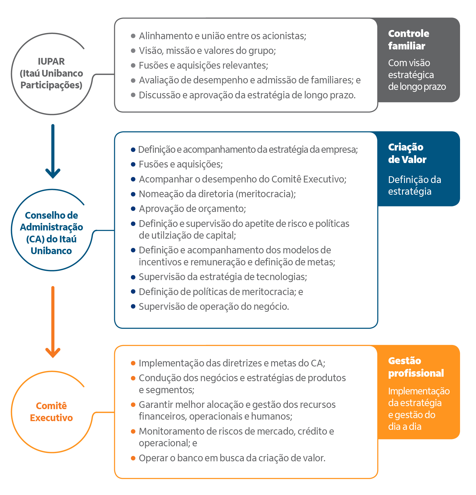 

Fonte: [(IUPAR - 2020)](<https://www.itau.com.br/relacoes-com-investidores/show.aspx?idCanal=vwRz5Vohb4ufKQ5nOZ68dw==&linguagem=pt>)  

    Figura 3 - Organograma da estrutura da administração, estruturado em fórum colegiados, visando uma abordagem diversificada dos assuntos para uma tomada de decisão. 
  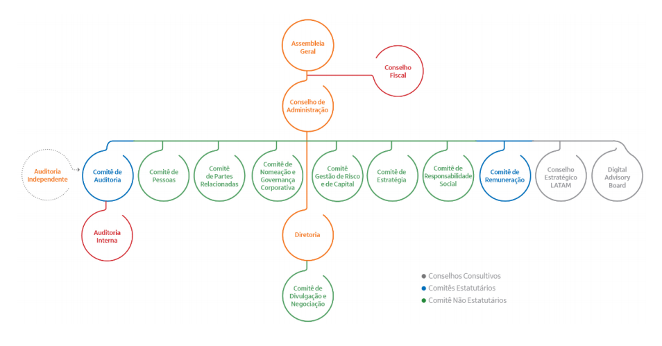

Fonte: [(IUPAR - 2020)](<https://www.itau.com.br/relacoes-com-investidores/show.aspx?idCanal=vwRz5Vohb4ufKQ5nOZ68dw==&linguagem=pt>)  

**Princípios Básicos da Governança Corporativa**

Os princípios básicos de governança corporativa permeiam, em maior ou menor grau, todas as práticas do Código das Melhores Práticas de Governança Corporativa, e sua adequada adoção resulta em um clima de confiança tanto internamente quanto nas relações com terceiros. São eles:

**Transparência** – Consiste no desejo de disponibilizar para as partes interessadas as informações que sejam de seu interesse e não apenas aquelas impostas por disposições de leis ou regulamentos. Não deve restringir-se ao desempenho econômico-financeiro, contemplando também os demais fatores (inclusive intangíveis) que norteiam a ação gerencial e que conduzem à preservação e à otimização do valor da organização; 

**Equidade** – Caracteriza-se pelo tratamento justo e isonômico de todos os sócios e demais partes interessadas (stakeholders), levando em consideração seus direitos, deveres, necessidades, interesses e expectativas;

**Prestação de contas (accountability)** – Os agentes de governança devem prestar contas de sua atuação de modo claro, conciso, compreensível e tempestivo, assumindo integralmente as consequências de seus atos e omissões e atuando com diligência e responsabilidade no âmbito dos seus papéis;   

**Responsabilidade corporativa** – Os agentes de governança devem zelar pela viabilidade econômico-financeira das organizações, reduzir as externalidades negativas de seus negócios e suas operações e aumentar as positivas, levando em consideração, no seu modelo de negócios, os diversos capitais (financeiro, manufaturado, intelectual, humano, social, ambiental, reputacional, etc.) no curto, médio e longo prazos.

Fonte: [(IBGC, 2020)](<https://www.ibgc.org.br/conhecimento/governanca-corporativa>)

### 2.2 Definição do comitê Gestor

Para facilitar a compreensão da Governança em um Data Lake, vamos criar um "case", utilizando uma estrutura organizacional simples, com algumas áreas.

**O PMO, Project Management Office, ou em português, Escritório de Gerenciamento de Projetos**

O PMO tem como objetivo desenvolver e fornecer recursos intelectuais, processos e procedimentos para definição do **escopo**, planejamento das atividades, **pessoas**  e **aquisições** necessárias para execução, a qual fornece um estudo prévio de **prazo** e de  entregáveis, critérios de **qualidade** e aceitação, também fornece um **orçamento** prévio para atingimento dos objetivos com **integração** de pessoas, áreas e ferramentas, identificação e monitoramento de **riscos** e a **comunicação** do andamento do programa , performance e resultados medidos por indicadores pré-definidos para as **partes envolvidas** nos diversos fóruns comitês e demais canais.

    Figura 4 - Escritório de Gerenciamento de Projetos. 
  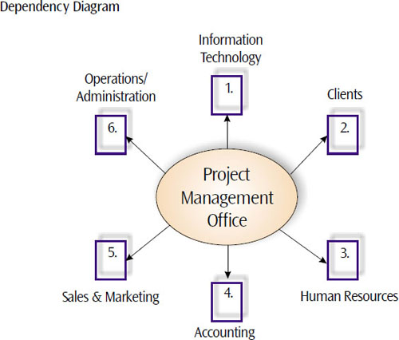

Fonte:  [(PMI, 2020)](https://www.pmi.org/learning/library/process-developing-custom-pmo-proposal-3133)  

Conforme diagrama de dependência, [(PMI, 2020)](<https://www.pmi.org/learning/library/process-developing-custom-pmo-proposal-3133>), o PMO é uma área com visão de toda a organização, e depende de receber a demanda para estabelecer processos, ferramentas e rotinas de monitoramento e controle no planejamento e execução dos projetos. Ao receber uma demanda, o responsável pelo PMO, seleciona uma pessoa e o apresenta como Gerente do Programa, com a finalidade de engajar um time de projeto capaz de integrar as áreas envolvidas para entender a demanda e produzir o resultado esperado pelos demandantes, com restrição de prazo e orçamento.

Para uma melhor contextualização do nosso artigo, vamos descrever o objetivo do programa como **“adequação a legislação de proteção dos dados, identificar e corrigir possíveis vazamentos de informação ou acesso indevido, com fins alheios aos interesses da empresa, que possam vir a trazer algum prejuízo financeiro via indenizações ou a imagem da empresa”**.

**As áreas de suporte intelectual e operacional, Pessoas, Tecnologia e Jurídico**

Conforme nosso artigo, a área de tecnologia juntamente com a área Jurídica tem papel fundamental no programa, e é a partir das necessidades apresentadas pelo jurídico que os estudos tecnológicos são realizados, e algumas alternativas são discutidas, sendo necessário estabelecer um grupo multidisciplinar com pessoas capacitadas em suas áreas de conhecimento para administrar os dados da empresa, canais de entrada, transformação e armazenamento, este grupo pode recomendar um estudo de maturidade da empresa em relação aos dados, onde estão e como são protegidos. O grupo pode definir o uso conceitual de uma ferramenta e/ou tecnologia, e neste momento é submetido ao PMO a carta de viabilidade, recursos intelectuais aquisições necessárias, bem como plano de implantação e de investimentos.

**As áreas de monitoramento, Auditoria e Controles Internos**

Como vimos, nossa demanda é para atender a legislação, e como vamos tratar de riscos operacionais e de imagem da organização afim de evitar prejuízos financeiros, as áreas de auditoria e controles internos define como avaliar o programa, e fazem recomendações de políticas e regras de proteção e acesso aos dados, também desenvolvem um checklist de verificação para acompanhamento durante a implantação e após sua operacionalização.
As áreas de negócios, logística e produção

**Origem dos Dados**

Atualmente temos fonte infinita para captura dos dados, que pode ser por um aplicativo com interação humana, IoT, aprendizado de máquina, sinais e transmissores de qualquer natureza, ás áreas de negócios, mais do que nunca estão entrelaçadas com a ás áreas de logística e produção, pois um pedido de manufatura, não necessariamente passa por uma pessoa, as vendas são realizadas por uma coke ou coffee machine, os pedidos são enviados automaticamente para logística que cuida da distribuição, que pode ser no modelo tradicional, usando carros e equipamentos com operador, ou até nos modelos atuais de drones, carros e equipamentos autônomos, responsáveis pelo abastecimentos dos estoques finais, que a partir de métricas de armazenamento, dispara um pedido de produção aos setores de manufatura, e não se trata apenas de um produto, pode ser um serviço ligado a vida, que faz o diagnóstico conforme parâmetros pré-estabelecidos, e envia para um sistema que a partir de indicadores faz análise e recomendações para evitar enfermidades e a até morte, maquinas ligadas a vida monitoram sinais vitais e a partir da dinâmica do aprendizado de máquina, verifica-se a suplementação vitamínica e/ou proteica necessária.

    Figura 5 - Fonte de Dados 
  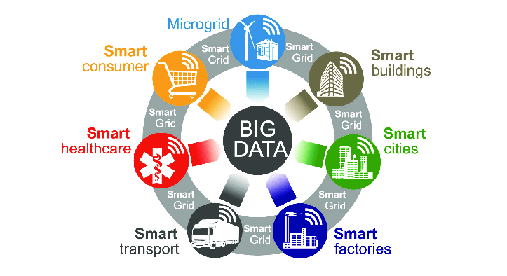

Fonte: [(ZIELINSKI, 2018)](https://www.researchgate.net/publication/324230350_Does_Smart_Grid_need_new_Informatics_Tools)

A origem, os canais de captura e o formato dos dados não tem tanta importância em relação ao armazenamento, pois devemos estar preparados para armazenar todo tipo de dado, mas para implementar uma estratégia de proteção e acesso aos dados, as áreas de negócios devem conhecer profundamente qual o tipo de informação que é importante para alavancar os negócios, bem como o tipo de acesso que cada pessoa ou grupo de pessoas devem ter em seus canais de captura e inserção de dados e manipulação de relatórios. 

Um pedido de venda originado pela área de negócios, em seus infinitos canais, contém informações que devem ser protegidas, como dados pessoais do comprador, documentos, endereço forma de pagamento, e de suas preferências de compra, produtos, preços, quantidade e intervalos de compras, pois ele passa pelo setor produtivo, onde é feito o planejamento de produção com dados do produto e quantidade, e depois enviados ao cliente; ou, um cliente que abre uma conta bancária por um canal digital, informa seus dados pessoais e patrimoniais, necessita transitar informações financeiras de uma organização para outra, e recebe as suas correspondências físicas; ou, no envio de um pedido de vitamina D para uma farmácia, gerado por um equipamento ligado a vida, em comum, todos passam por um setor de 
logística e de distribuição, que pode ter muitas pessoas, através de suas empresas, parcerias e terceirizações e envolvidas com a informação, assim, embora tenhamos um ponto de encontro dos dados, eles estão replicados em outras estruturas de dados nos canais de parceria ou de prestação de serviços, sendo necessário uma política completa para a fragmentação da informação, de modo que cada acesso seja monitorado e controlado, uma definição clara de quem pode ver o que, de forma centralizada na origem da demanda, o demandado deve controlar e proteger a informação nos diversos canais, oferecendo acesso seguro e simplificado nas suas relações empresariais.

Agora que entendemos o que precisa ser feito, quem faz o que e quando e qual o investimento, é desenvolvida a governança para o Data Lake, um dos itens mais importante, e é o fator de sucesso do programa, que após definida, deve ser submetida para aprovação do comitê executivo, que aprovada com pessoas, fóruns e responsabilidades, inicia o trabalho.

    Figura 6 - Estrutura de Comitês 
  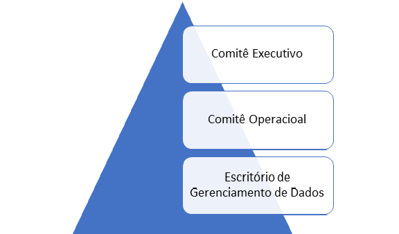
    Fonte: do autor, 2020  

Em nossa estrutura de comitês, podemos descrever cada um deles da seguinte forma, composição, atuação e responsabilidade:

**Comitê Executivo**

Comitê formado pelos principais executivos da empresa, que tem como missão tomar as decisões estratégicas, receber e encerrar as fases ou projetos, responsável pelo  orçamento, aprovar novos investimentos, e engajamento da alta administração.

**Comitê Operacional**

Os executivos responsáveis pelos dados da empresa, em suas diversas áreas, tem como principal motivação resolver conflitos operacionais, analisar alternativas para o perfeito funcionamento e acesso aos dados, aprovar políticas e controles internos para o uso adequado da informação, oferecer suporte as áreas para identificar e mitigar ou eliminar o risco de perda e de vazamento de informação restrita.

**Escritório de Gerenciamento de Dados**

    Figura 7 - Escritório de Gerenciamento de Dados 
  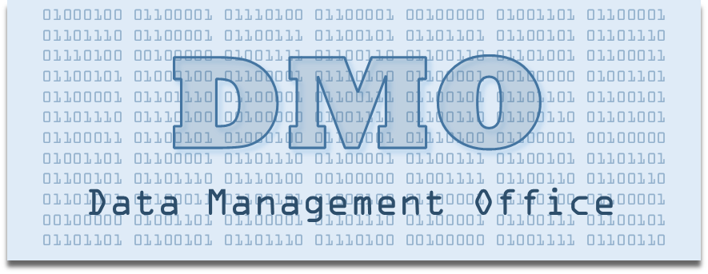

Fonte: [(phila.gov, 2020)](https://www.phila.gov/hhs/data/Pages/default.aspx)

Composto por uma equipe multidisciplinar, é a área responsável pelos estudos e implementação das melhores práticas na gestão dos dados da organização, de onde nascem as políticas e diretrizes de vão permear toda organização. Área liderado por um CDO (Chief Data Officer), segundo a definição da [(IBM, 2018)]( <https://www.ibm.com/thought-leadership/institute-business-value/report/chief-data-officer>). é um líder de negócios que cria e executa estratégias de dados e análises para gerar valor de negócios. Responsável por definir, desenvolver e implementar a estratégia e os métodos pelos quais a organização adquire, gerencia, analisa e governa os dados. também tem a responsabilidade estratégica de conduzir a identificação de novas oportunidades de negócios por meio do uso mais eficaz e criativo de dados

## 3. Lei Geral de Proteção de Dados (LGPD)
### 3.1 O que norteia a LGPD ? ###

O debate em torno da privacidade no Brasil é mais antigo do que imaginamos. Em 2010 foi realizada a primeira consulta pública sobre o tema pelo Ministério da Justiça (cerca de 2.500 contribuições) segundo dados do Núcleo de Informação e Coordenação do Ponto BR (NIC.br). A linha do tempo abaixo mostra os debates e o surgimento da LGPD (NIC.BR,2020):

* 13.5.16: consulta pública do MJ resulta no PL 5.276/16, de autoria do Poder Executivo;
* 17.3.18: caso Cambridge Analytica/Facebook;
* 25.5.18: eficácia plena do GDPR;
* 29.5.18: PL 5.276/2016 e 4.060/12 declarados prejudicados em face de Subemenda Substitutiva de Plenário (PLC 53/2018 – Orlando Silva). Texto aprovado na Câmara;
* 10.7.18: PLC 53/18 aprovado no Senado, nos termos do parecer do CAE, restando prejudicado o PLS 330/13;
* Sanção: 14/8/2018, com veto à criação da Autoridade Nacional de Proteção de Dados (ANPD), sob a alegação de um possível vício de iniciativa (Projeto de lei de iniciativa parlamentar que cria órgão ou entidade da Administração Pública atingiria o desenho de competências legislativas. Haveria, pois, inconstitucionalidade insuperável e insanável, a justificar o veto). Porém, mais de 40 artigos que se referem diretamente a ANPD não foram vetados, felizmente;
* Publicação no Diário Oficial da União: 15/8/2018 (inicialmente com 18 meses de prazo para sua eficácia plena – vacacio legis);
* MP 869/18: 28/12/2018 (entre outras questões cria a ANPD e acrescenta mais seis meses de vacacio legis);
* Eficácia plena da LGPD: 16.08.20.

Como ilustrado na figura 8 abaixo, a discussão acerca da LGPD não é nova e está presente desde 2010 no cenário legislativo. 

    Figura 8 - Via crucis da LGPD    
  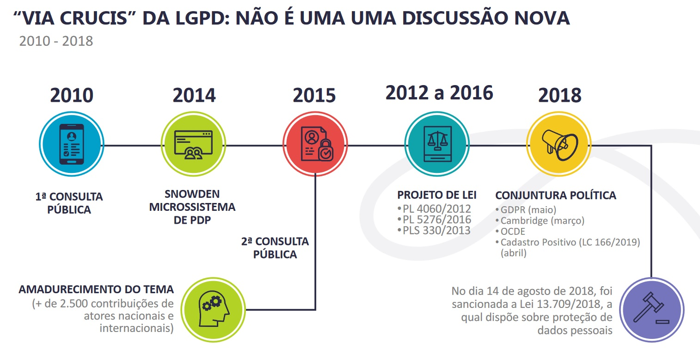
   
  Fonte: RIELLI, 2020
   
  

A Lei Geral de Proteção de Dados (LGPD), Lei 13.709/2018, entrou em vigor em 18 de setembro de 2020 a partir da sanção, pelo Presidente Jair Bolsonaro, da Lei nº 14.058/2020 (FEDERAL,200). A LGPD é um marco legal que regulamenta o uso, a proteção e a transferência de dados pessoais no Brasil. Ela garante maior vigília  sobre as informações pessoais, exigindo consentimento explícito para coleta e uso dos dados e obriga a oferta de opções para o usuário visualizar, corrigir e excluir esses dados, conforme disposto no seu art.1° abaixo.

**O tratamento de dados pessoais, inclusive nos meios digitais, por pessoa natural ou por pessoa jurídica de direito público ou privado, com o objetivo de proteger os direitos fundamentais de liberdade e d privacidade e o livre desenvolvimento da personalidade da pessoa natural.**

****
### 3.2 Dado pessoal ###

Para os fins de aplicação da LGPD os dados são definidos como:

**I - dado pessoal:** informação relacionada a pessoa natural identificada ou identificável

      * Identificada e Identificável (cookies, outros identificadores eletrônicos e geoloacionais)

A figura 9 apresenta exemplos do que podem ser classificados ou não como elementos do dado pessoal.

    Figura 9 -Elemento dado pessoal    
  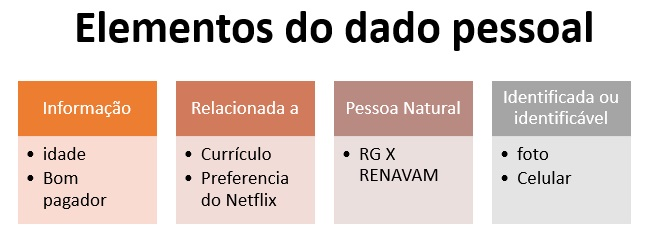
   
  Fonte: Elaborado pelos autores, 2020
   
  

**II - dado pessoal sensível:** dado pessoal sobre origem racial ou étnica, convicção religiosa, opinião política, filiação a sindicato ou a organização de caráter religioso, filosófico ou político, dado referente à saúde ou à vida sexual, dado genético ou biométrico, quando vinculado a uma pessoa natural;

      Áreas de monitoramento, Auditoria e Controles Internos**

A LGPD delinea as diretrizes de como tratar de riscos operacionais e de imagem da organização, afim de evitar prejuízos financeiros e riscos jurídicos, protegendo dados cujo uso indevido *Pode acarretar em práticas discriminatórias
      
      *Saúde, orientação sexual, política, biometria, genéticos
      *Dados de crianças e adolescentes
    

**III - dado anonimizado:** dado relativo a titular que não possa ser identificado, considerando a utilização de meios técnicos razoáveis e disponíveis na ocasião de seu tratamento;

### 3.3 Direitos garantidos aos titulares de dados ###

Na figura 10, podemos observar a relação dos artigos da lei que discorrem sobre os direitos garantidos aos titulares de dados.

    Figura 10 - Direitos garantidos aos titulares de dados    
  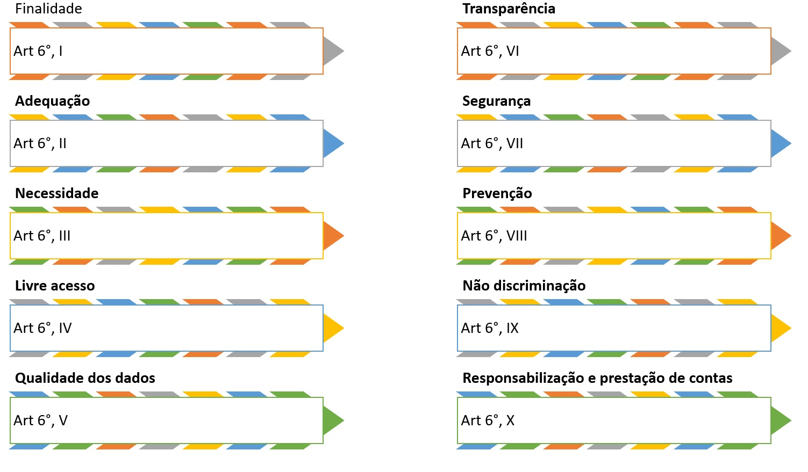
   
   Fonte: Elaborado pelos autores, 2020
   

A  LGPD  nos  traz  em  seu  art.  6°  os  princípios  que  devem  ser  seguidos  ao  realizar tratamentos de dados pessoais:

**I - finalidade:** realização do tratamento para propósitos legítimos, específicos, explícitos e informados ao titular, sem possibilidade de tratamento posterior de forma incompatível com essas finalidades;

**II - adequação:** compatibilidade do tratamento com as finalidades informadas ao titular, de acordo com o contexto do tratamento;

**III - necessidade:** limitação do tratamento ao mínimo necessário para a realização de suas finalidades, com abrangência dos dados pertinentes, proporcionais e não excessivos em relação às finalidades do tratamento de dados;

**IV - livre acesso:** garantia, aos titulares, de consulta facilitada e gratuita sobre a forma e a duração do tratamento, bem como sobre a integralidade de seus dados pessoais;

**V - qualidade dos dados:** garantia, aos titulares, de exatidão, clareza, relevância e atualização dos dados, de acordo com a necessidade e para o cumprimento da finalidade de seu tratamento;

**VI - transparência:** garantia, aos titulares, de informações claras, precisas e facilmente acessíveis sobre a realização do tratamento e os respectivos agentes de tratamento, observados os segredos comercial e industrial;

**VII - segurança:** utilização de medidas técnicas e administrativas aptas a proteger os dados pessoais de acessos não autorizados e de situações acidentais ou ilícitas de destruição, perda, alteração, comunicação ou difusão;

**VIII - prevenção:** adoção de medidas para prevenir a ocorrência de danos em virtude do tratamento de dados pessoais;

**IX - não discriminação:** impossibilidade de realização do tratamento para fins discriminatórios ilícitos ou abusivos;

**X - responsabilização e prestação de contas:** demonstração, pelo agente, da adoção de medidas eficazes e capazes de comprovar a observância e o cumprimento das normas de proteção de dados pessoais e, inclusive, da eficácia dessas medidas.

### 3.4 Como realizar o tratamento dos dados pessoais ? ###

Na figura 11, temos a relação dos artigos da lei que contém as diretrizes para o tratamento de dados pessoais.

    Figura 11 - Hipóteses de tratamento de dados pessoais    
  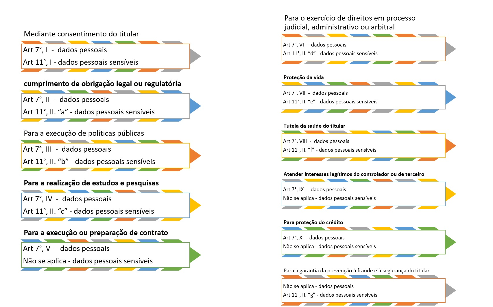
   
   Fonte: Elaborado pelos autores, 2020
   

O capítulo II da LGPD traça as orientações e diretrizes sobre como devemos realizar o tratamento de dados pessoais. Sobre o tópico de tratamento de dados pessoais, o capítulo possui as seguintes seções: Dos Requisitos para o Tratamento de Dados Pessoais, Do Tratamento de Dados Pessoais Sensíveis, Do Tratamento de Dados Pessoais de Crianças e de Adolescentes e Do Término do Tratamento de Dados. Por esse motivo teve ser levado em consideração os direitos do titular e os deveres do controlado destes dados. 

O tratamento de dados pessoais, conforme a disposição do art. 7º da LGPD, somente poderá ocorrer nos seguintes casos:

**I** - mediante o fornecimento de consentimento pelo titular; 

**II** - para o cumprimento de obrigação legal ou regulatória pelo controlador;

**III** - pela administração pública, para o tratamento e uso compartilhado de dados necessários à execução de políticas públicas previstas em leis e regulamentos ou respaldadas em contratos, convênios ou instrumentos congêneres, observadas as disposições do Capítulo IV desta Lei; 

**IV** - para a realização de estudos por órgão de pesquisa, garantida, sempre que possível, a anonimização dos dados pessoais;

**V** - quando necessário para a execução de contrato ou de procedimentos preliminares relacionados a contrato do qual seja parte o titular, a pedido do titular dos dados; 
**VI** para pleitos em processo judicial, administrativo ou arbitral;

**VII** para a proteção da vida ou da incolumidade física do titular ou de terceiro;

**VIII** para a tutela da saúde, em procedimento realizado por profissionais da área da saúde ou por entidades sanitárias;

**IX** para atender aos interesses legítimos do controlador ou de terceiro, exceto no caso de prevalecerem direitos e liberdades fundamentais do titular que exijam a proteção dos dados pessoais;

**X** para a proteção do crédito, nos termos do Código de Defesa do Consumidor (CDC).

O tratamento de dados pessoais de crianças e de adolescentes, conforme disposição do art. 14º da LGPD, somente poderá ocorrer nos seguintes casos:

**I** - consentimento específico e  dado por pelo menos um dos pais ou pelo responsável legal;

**II** - No tratamento de dados os controladores deverão manter pública a informação sobre os tipos de dados coletados, a forma de sua utilização;

### 3.5 Relatório de Impacto à Proteção dos Dados Pessoais (RIPD)  ###

Para auxiliar na elaboração do relatório de impacto à proteção de dados pessoais são sugeridas sete etapas, que estão apresentadas na figura 12.
 

    Figura 12 - Relatório de Impacto à Proteção dos Dados Pessoais (RIPD)    
  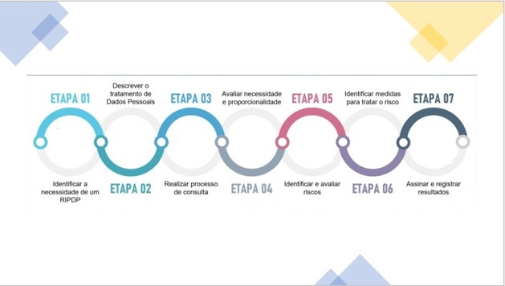
   
   Fonte: Elaborado pelos autores, 2020
   

Art. 5º Para os fins desta Lei, considera-se:

**XVII - relatório de impacto à proteção de dados pessoais:** documentação do controlador que contém a descrição dos processos de tratamento de dados pessoais que podem gerar riscos às liberdades civis e aos direitos fundamentais, bem como medidas, salvaguardas e mecanismos de mitigação de risco; 

Enquanto o art. 5º inciso XVII define o que é um RIPD, o seu conteúdo mínimo é indicado pelo o disposto
no art. 38.

**Art. 38. A autoridade nacional poderá determinar ao controlador que elabore relatório
de impacto à proteção de dados pessoais**, inclusive de dados sensíveis, referente a suas
operações de tratamento de dados, nos termos de regulamento, observados os segredos
comercial e industrial.

## <a name=“section4”><a/> 4. O Data Lake 
### 4.1 Origem do Termo

Por conta dessa necessidade, em 2010 James Dixon cunhou o termo Data
Lake [(FOOTE, K. 2018)](https://www.dataversity.net/brief-history-data-lakes/), descrevendo uma arquitetura híbrida para armazenamento
massivo de informações em qualquer formato, incluindo dados não estruturados, em
um único local, tornando o Data Lake a peça central de infra-estrutura em uma
arquitetura orientada à dados. Dixon [(BAUM, 2020, p.3)](https://itupdate.com.au/assets/snowflake/snowflake-cloud-data-lakes-for-dummies-special-edition.pdf) defende que "o Data Lake é um grande corpo de
água, no qual a água entra e sai por diversos dutos, e de onde exemplos podem ser
retirados e analisados”

### <a name=“section42”><a/> 4.2 Arquitetura de Referência

O Data Lake deixa o dado disponível para ser lido, permitindo que qualquer
pessoa com o conhecimento apropriado tenha acesso para explorar e analizar toda
a gama de dados existente no Data Lake afim de obter informação desejada. Para
entender como o Data Lake possibilita isso, a Figura 14 abaixo mostra uma
arquitetura simples dessa tecnologia, exemplificando as grandes fases do processo,
divididos entre captura, armazenamento e entrega dos dados.

Figura 14 - Arquitetura do Data Lake tradicional. 
 
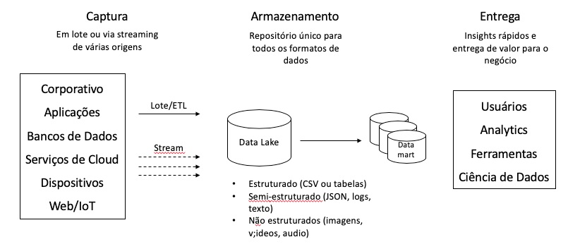
 
Fonte: [BAUM, 2020, p.4 - Adaptado](https://itupdate.com.au/assets/snowflake/snowflake-cloud-data-lakes-for-dummies-special-edition.pdf)
 

Na Figura 14, temos uma apresentação de alto nível para uma arquitetura de Data Lake tradicional, na seção 4.5 essa arquitetura será apresentada 
de um forma mais detalhada.

Levando em conta que atualmente são gerados 2.5 quintilhões de bytes de dados por dia 
[(MARR, B., 2018)](https://ciradar.com/competitive-intelligence-blog/insights/2019/08/28/how-much-data-do-we-produce), que mais de 80% desses dados são de
característica não estruturada e que tecnologias como IoT devem triplicar a
quantidade de informações que geramos por dia, fica claro que a peça central de
uma arquitetura orientada à dados deve ser capaz de suportar uma quantidade
colossal de dados, sendo o Data Lake a melhor opção conhecida para ser o
armazenamento do que conceitualmente denominamos como Big Data [(DOMO,
2017)](https://www.domo.com/blog/data-never-sleeps-5/).

### 4.3 Arquitetura de processamento de dados em larga escala

De acordo com [AKHATAR (2018, Cap.1)](https://www.amazon.com/Big-Data-Architects-Handbook-proficiency/dp/1788835824), a definição de Big Data são “dados
massivos em volume, com relação ao sistema de processamento, com uma
variedade de dados estruturados e não estruturados quem contêm diferentes
padrões de dados a serem analisados”.

Além do conceito supracitado, alguns especialistas defendem que para um
sistema ser considerado um Big Data, ele deve conter 3 características principais, os
3 V’s do Big Data, são eles segundo [RAMADAN (2017)](https://www.researchgate.net/publication/325103690_Big_Data_Tools-An_Overview.):

**Volume:** Talvez o mais obvio dos 3 V's, fazendo referência ao “big” no
termo Big Data, volume é uma caraterística direta do termo em questão. Como a
quantidade de dados crescendo na velocidade já citada, ter a capacidade de
absorver volumes gigantescos de dados é uma característica imperativa nos
processos de análise de dados atuais e futuros.

**Velocidade:** O segundo V faz alusão à velocidade em que os dados são
gerados ou inseridos em uma plataforma de Big Data. Na Figura 15 a seguir, podemos ver
que, na média, em apenas 60 segundos do ano de 2019, foram enviados 18.100.000
mensagens de texto entre celulares e 4.497.420 de buscas foram realizadas no
Google, tudo isso alimentando em tempo real os sistemas de dados das empresas
que prestam esses serviços.

**Variedade:** Por variedade podemos entender os diferentes tipos de dados
processados numa plataforma de Big Data, sejam esses estruturados ou não
estruturados, sendo que o Big Data conseguiu transformar a realidade de um
universo primordialmente de dados estruturados em bacos relacionais. Hoje é
possível cruzar informações de diversas características, como por exemplo o perfil
de uma pessoa solicitando um motorista, dependendo da sua localização dentro de
um centro urbano com uma determinada condição climática.

Figura 15 - “A cada um minuto em 2019...” 
 

 
Fonte: [MARR, B., 2018](https://ciradar.com/competitive-intelligence-blog/insights/2019/08/28/how-much-data-do-we-produce)
 

Além dos 3 V’s existem vertentes conceituais que querem transformar em 8
V’s, adicionando muitas outras características, porém os conceitos mais amplamente
aceitos são Veracidade e Valor, criando 5 Vs, sendo assim:

**Veracidade:** Levando em conta que nem todo dado é relevante para a
análise em questão a acurácia do dado é importante para o sistema de Big Data como 
um todo para trazer valor à análise, dessa forma, quanto maior a acurácia do
dado, melhor é qualidade de informação final.

**Valor:** Se considerarmos que o objetivo do Big Data é entregar informação
que gere conhecimento para o negócio, nada mais significativo do que valor como
requisito a ser incluído na arquitetura.

### 4.4 Os pilares de uma arquitetura de processamento de dados em larga escala

Independente da arquitetura a ser implementada para Big Data, o ideal é
que os componentes sejam desacoplados entre si, trazendo benefícios como
facilidade de manutenção, melhoria de custos, velocidade para escalar o ambiente e
muitos outros. Sendo assim, é interessante enxergar a arquitetura de dados como
grandes pilares, conforme descrito na Figura 16 a seguir.

Figura 16 - Processos de Big Data simplificado. 
 

 
Fonte: [SNIVELY, 2018, slide 9](https://www.slideshare.net/AmazonWebServices/big-data-analytics-architectural-patterns-and-best-practices-ant201r1-aws-reinvent-2018) 
 

De forma direta, os dados são coletados pela plataforma de diversas
origens, em seguida são armazenados para que sejam acessados quando
necessário. O próximo passo é processar os dados com o objetivo de extrair
informações relavantes e analizar os casos em que essas informações são
aplicáveis. Em seguida essas informações ficam disponíveis para serem acessadas
e interpretadas por áreas de negócio ou analistas que tomam decisões baseadas
nessas informações.

### 4.5 Arquitetura de Big Data

Para que uma estrutura de Big Data entregue o valor descrito com as
capacidades citadas, é importante que se tenha uma arquitetura de componentes
que comporte as necessidades descritas anteriormente, sendo assim, a Figura 17 a seguir
descreve uma arquitetura genérica de referência para ser utilizada em ambientes de
Big Data bem como a descrição de cada componente.

Figura 17 - Arquitetura de componentes de Big Data. 
 
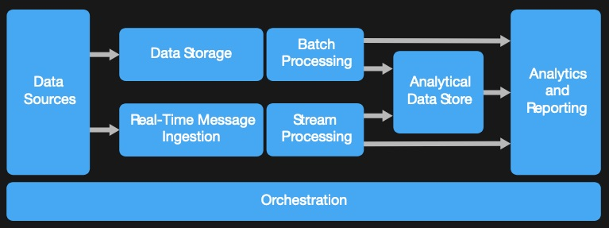
 
Fonte: [MICROSOFT, 2019](https://docs.microsoft.com/pt-br/azure/architecture/guide/architecture-styles/big-data)  
 

**Origem de dados:** (Data Sources) Nada mais é do que a origem dos diversos dados que
comporão a plataforma de Big Data e, levando em conta o conceito de Data Lake, a
origem de dados pode ser virtualmente qualquer dado de qualquer característica
(estruturado ou não). Desde arquivos de logs ou transcrições de um telefonema,
passando por tabelas vindas do ERP ou planilhas alimentadas por prestadores de
serviços.

**Armazenamento de dados:** (Data Storage) É o repositório de todo o Big Data, uma
estrutura de Data Lake com capacidade de armazenar grandes volumes de dados e
escalar conforme o crescimento do ambiente.

**Ingestão de mensagens em tempo real:** (Real-Time Message Ingestion) Esse é um componente que
depende do objetivo da estrutura de Big Data e deve ser usado quando existe a
necessidade de consumir e processar dados em tempo real. De forma genérica, as
mensagens são recebidas pela estrutura e armazenadas temporariamente antes de
serem inseridas no sistema de Big Data. Essa abordagem é útil pois pode funcionar
como um cache de informações, guardando dados, sem correr o risco de prejudicar
a capacidade do Data Lake de receber os dados em tempo real. Arquiteturas que
dependem de sensores de IoT, dados de trânsito e muitos outros fazem uso dessa
abordagem.

**Processamento em lote:** (Batch Processing) Este componente remonta da mesma estratégia
utilizada em ETLs (do inglês Extract, Transform and Load) convencionais, onde
grandes quantidades de dados de demandam muito tempo de processamento. Em
geral, neste passo, utilizam-se abordagens mais inovativas como MapReduce, onde
o objetivo é executar algoritmos que, paralelamente mapeam as entradas dos dados
com o uso de dicionários de palavras e clusterizam esses dados, agregando em
formatos mais simples e compartimentados que são a entrada para componentes
seguintes da arquitetura.

**Processamento de stream (fluxo):** (Stream Processing) Stream é um mecanismo de entrada
pervasivo que aceita qualquer tipo de mensagem que vêm do componente
responsável por executar a ingestão de dados em tempo real, por conta disso, é
necessário fazer uma sanitização básica dos dados recebidos. Independente da
qualidade, neste passo aplicam-se filtros e agregação de dados para que os
mesmos sejam persistidos com mais qualidade no componente seguinte.

**Armazenamento de dados analíticos :** (Analytical Data Store) Uma vez com os dados
processados, é comum que o destino final dos dados processados sejam bancos de
dados, na sua maioria, em modelos não relacionais como bancos NoSQL de
documentos ou relacionais, como Data Warehouse. Isso acontece porque a maioria 
das ferramentas de análise de dados são preparadas para fazer interfaces com
esses bancos de dados.

**Análise e relatórios:** (Analytics and Reporting) Como dito anteriormente, o grande objetivo de
soluções de Big Data é preparar o dado bruto para ser analisado e, para isso, a
solução faz toda a preparação e processamento do dado e o transforma em dado
estruturado num modelo analítico para que então um profissional capacitado possa
extrair informação de qualidade sobre aqueles dados. É comum que os profissionais
de análise façam uso de ferramentas de modelagem e visualização de dados para
que encontrem a melhor informação possível para tomar decisões.

**Orquestração:** (Orchestration) Em geral, soluções de Big Data fazem processamentos
repetidos, conhecidos como fluxo de trabalho. Como exemplo prático podemos citar
transformação de dados de entrada, carregamento de sistemas, inserção em
sistemas ou tabelas, enfim, processos interdependentes que dependente de um
componente de orquestração para serem executados.

### 4.6 Big Data vs. Data Lake

Big Data não gera valor por si. A geração de valor é quando conseguimos criar insights que geram resultados tangíveis para o negócio. Entretanto, criar projetos de Big data não se constituem em tarefas simples. Existem muitas tecnologias, mas o desafio de integrar uma coleção muito diversa de dados estruturados e não estruturados não é trivial. A complexidade do trabalho é diretamente proporcional à variedade e volume dos dados que precisam ser acessados e analisados. Uma provável alternativa para este desafio é a criação de Data Lakes. Data Lake é um repositório que armazena um grande e variado volume de dados, estruturados e não estruturados. [(TIESPECIALISTAS, 2020)](https://www.tiespecialistas.com.br/big-data-e-o-data-lake/).

### 4.7 Cultura Data Driven

A cultura data driven (ou DDD, Data-Driven Decision) prioriza a tomada de decisão  
baseada em dados sob o argumento de que quanto mais informações estiverem acessíveis 
ao decisor e quanto mais detalhadas forem essas informações, mais eficiente e assertivo 
será o processo decisório, [(ALLSTRATEGY, 2020)](https://www.allstrategy.com.br/blog/cultura-data-driven-o-que-e-como-aplicar-no-seu-negocio-e-como-empresas-vem-utilizando).
Perceba que os modelos de negócios citados acima não existiriam sem a
disciplina de análise de dados pois exigem inúmeros tipos de dados sendo eles
estruturados, não estruturados, dados em tempo real, dados históricos, enfim, uma
quantidade e diversidade gigantesca de dados que precisam ser armazenados,
processados e interpretados para que uma decisão seja tomada, seja esta decisão
feita por um ser humano entendendo e avaliando a predisposição de um paciente
para uma doença, ou um algoritmo, recomendando um filme para você assistir onde
quiser. Além das empresas que possuem na informação seu principal negócio,
existe um conceito que vem ganhando força dia após dia que é a cultura de gestão
baseada em dados. Este modelo de gestão exclui a subjetividade do processo de
tomada de decisão e traz benefícios como visão clara das métricas da empresa,
aumento da produtividade e consequentemente dos lucros, antecipação de
possíveis falhas e problemas e velocidade na tomada de decisões. Todos esses
benefícios são alcançados com dados coletados ao longo dos processos já
existentes e precisam ser trabalhados para que se extraiam as informações que tem
valor para a empresa. 

## 5. LGPD e Governança no contexto de um Data Lake

### 5.1 Governança vs. Data Lake ###

A pergunta é: você está criando data lakes ou data swamps? A simples colocação de dados em uma plataforma de dados Hadoop não acelerará seus esforços de análise. Sem a governança ou a qualidade adequada, os data lakes podem se transformar rapidamente em data swamps impossíveis de gerenciar. Os usuários de dados sabem que os dados necessários estão nesses data swamps, mas sem uma estratégia clara de governança de dados, não será possível encontrar, confiar ou usar esses dados.
Um data lake governado contém dados claros e relevantes de origem estruturada e não estruturada que podem ser facilmente encontradas, acessadas, gerenciadas e protegidas. A plataforma na qual seus dados residem é altamente segura e confiável. Os dados inseridos em seu data lake são claros, classificados e protegidos corretamente em feeds de dados controlados e oportunos que preenchem e os documentam com ativos e metadados de informações confiáveis. [(IBM, 2021)](https://www.ibm.com/br-pt/analytics/use-cases/governing-data-lake).

### 5.2 LGPD vs. Data Lake ###

Com a entrada em vigor da LGPD, as preocupações dos usuários com a privacidade de dados deve ser direcionada aos documentos não estruturados. Segundo a cartilha publicada pela Controladoria Geral do Estado de Minas Gerais [(CGE-MG, 2020)](https://cge.mg.gov.br/phocadownload/manuais_cartilhas/pdf/Cartilha%20LGPD4%202.pdf), os dados não-estruturados são dados não organizados dentro de uma estrutura rígida definida, mas que estão presentes, por exemplo, em um arquivo de texto, tais como textos, planilhas, imagens, arquivos de áudio ou vídeo. Esses arquivos estão repletos de dados de usuários que precisam ser controlados e protegidos, contra vazamentos e acessos não autorizados. Esses dados não são mantidos em SGBDs, mas sim em Data Lakes.

Uma das medidas que podemos tomar para assegurar a proteção da maior parte dos documentos não estruturados é a adoção de sistemas de gestão eletrônica de documentos no ciclo de vida dos dados pessoais que só trafegam em modo criptografado e anonimizados. Em resumo, podemos entender o tratamento de dados como um ciclo de vida. 
  
## 6. Conclusão ##

Estabelecer uma arquitetura de dados depende majoritariamente do objetivo
da corporação e dos insumos de dados existentes, porém sem esse tipo de
abordagem, as empresas dos mais diversos segmentos terão dificuldades para se
manterem relevantes no mercado, tendo em vista que esta é uma condição
estratégica nos dias de hoje.

É óbvio que existem diversas abordagens e muitas formas de se realizar
este objetivo e, neste trabalho, focamos em uma estratégia conceitual e genérica de
arquitetura que tem sido amplamente utilizada no mercado por empresas que
tiveram sucesso nessa jornada de implementação de uma cultura baseada em
dados. Questões como escolha de fornecedores, detalhamento técnico, preços de
licenciamento e roadmap de produtos continuam precisando ser avaliadas e levadas
em consideração no momento da escolha e implementação de uma abordagem de
dados, porém as considerações feitas nesse trabalho permitem um ponto de partida
do cenário conceitual para a adoção de um fluxo de obtenção de informações.

É importante deixar claro também que nem todas as necessidades serão
sanadas com a abordagem apresentada neste trabalho, porém, é de suma
importância que os tomadores de decisões tenham claro seus objetivos e consigam
direcionar o escopo de implementação da estratégia de adoção de dados, sendo
assim, esse trabalho se coloca como um ponto de partida conceitual, e não como
um guia de implementação da estratégia de dados corporativa.

Por fim, é importante levantar necessidades para a estratégia de dados que
não foram abordados neste trabalho, como por exemplo, visualização de dados e
automação de processamento, que embora sejam disciplinas muito importantes, são
também extremamente personalizadas para as informações que serão tratadas,
ficando sob a responsabilidade do implementador entender as principais opções
disponíveis e implementar a abordagem mais coerente para o problema que deseja
resolver.

## Contribuições e Trabalhos Futuros ##

Por se tratar de um trabalho conceitual, explorar o detalhamento técnico de
como se implementar as diversas tecnologias citadas neste trabalho, como por
exemplo, Data Lake, Big Data, governança de dados ou segurança, são
trabalhos interessantes que complementariam este documento. Além disso,
questões não abordadas aqui como exploração e visualização de dados também
são disciplinas mais comumente dominadas no mercado que podem ser abordadas
em trabalhos futuros.

Outra evolução de tecnologia bastante relevante que tem ganho cada vez
mais espaço é o aprendizado de máquina (ou machine learning), que faz uso de
conceitos matemáticos para criar predições baseadas em dados históricos e
entender tendências futuras, sendo cada vez mais utilizado em sistemas de
exploração de dados.

## Referências ##

AKHATAR, S. Big Data Architect’s Handbook: A guide to biulding proficiency in tools
systems used by leading big data experts. Birminghan: Packt, 2018.

ALLSTRATEGY, 2020. Disponível em: <https://www.allstrategy.com.br/blog/cultura-data-driven-o-que-e-como-aplicar-no-seu-negocio-e-como-empresas-vem-utilizando>. 
Acesso em 07 de Jan. de 2021.

BARBIERI, CARLOS. Governanca de Dados - Práticas, Conceitos e Novos Caminhos. Rio de Janeiro, Alta Book, 2019

BAUM, D. Cloud Data Lakes for Dummies. Edição Especial. New Jersey: Snowflake.
2020.

BRASIL. Lei nº. 13.709, de 14 de agosto de 2018.Dispõe sobre a proteção de dados pessoais e altera a Lei nº 12.965, de 23 de abril de 2014 (Marco Civil da Internet). Disponível em: http://www.planalto.gov.br/ccivil_03/_ato2015-2018/2018/Lei/L13709.htm Acesso em: 13 de Nov 2020.

CGE-MG. Cartilha LGPD Disponível em: <https://cge.mg.gov.br/download/category/35-arquivos-diversos?download=450:cartilha-lgpd> Acesso em: 02 de Jan. de 2021

DOMO, Data Never Sleeps 5.0, Domo.com, 2017. Disponível em:
<https://www.domo.com/learn/data-never-sleeps-
5?aid=ogsm072517_1&sf100871281=1>. Acesso em: 25 de Nov. de 2020.

FEDERAL, Senado. Senado Notícias. Disponível em: https://www12.senado.leg.br/noticias/materias/2020/09/18/lei-geral-de-protecao-de-dados-entra-em-vigor 
Acesso em 13 Nov 2020.

FOOTE, K. A Brief History of Data Lakes. Dataversity.net, 2018. Disponível em: <
https://www.dataversity.net/brief-history-data-lakes/>. Acesso em: 13 de Nov. de
2020

IBGC, Instituto Brasileiro de Governança Corporativa, 2020. Disponível em:
https://www.ibgc.org.br/conhecimento/governanca-corporativa
Acesso em 24 de Set de 2020

IBM, Institute for Business, The new hero of big data and analytics: The Chief Data Officer
https://www.ibm.com/thought-leadership/institute-business-value/report/chief-data-officer
Acesso em 24 de Set de 2020

IBM, Institute for Business, 2021. Disponível em: <https://www.ibm.com/br-pt/analytics/use-cases/governing-data-lake>. 
Acesso em: 07 de Jan 2021.

IUPAR, Site de Relações com Investidores, 2020. Disponível em:
https://www.itau.com.br/relacoes-com-investidores/show.aspx?idCanal=vwRz5Vohb4ufKQ5nOZ68dw==&linguagem=pt
Acesso em 24 de Set de 2020

JAMES, J. What ‘Data Never Sleeps 7.0’ Says—and Doesn’t Say. Domo.com, 2019.
Disponível em: <https://www.domo.com/blog/what-data-never-sleeps-7-0-says-anddoesnt-
say/>. Acesso em: 25 de Nov. de 2020.

MARR, B. How Much Data Do We Create Every Day? The Mind-Blowing Stats
Everyone Should Read. Forbes.com, 2018. Disponível em:
<https://www.forbes.com/sites/bernardmarr/2018/05/21/how-much-data-do-wecreate-
every-day-the-mind-blowing-stats-everyone-should-read/#23cc78e60ba9>. Acesso em: 18 de Nov. de 2019.

MICROSOFT. Estilo de Arquitetura de Big Data. Microsoft.com, 2019. Disponível em:
<https://docs.microsoft.com/pt-br/azure/architecture/guide/architecture-styles/bigdata>.
Acesso em: 18 de Nov. de 2020.

NIC.br - Núcleo de Informação e Coordenação do .br. Como era e como fica a Lei Geral de Proteção de Dados 
Disponível em:<https://www.nic.br/noticia/na-midia/como-era-e-como-fica-a-lei-geral-de-protecao-de-dados/>
Acesso em: 16 de Dez. de 2020.

Site Governo da Philadelphia, Estados Unidos da América
https://www.phila.gov/hhs/data/Pages/default.aspx
Acesso em: 16 de Dez. de 2020.

PMI. Developing a proposal for implementing a PMO. PMI.org, 2020. Disponível em:
https://www.pmi.org/learning/library/process-developing-custom-pmo-proposal-3133
Acesso em: 24 de Set de 2020.

RAMADAN, R. Big Data Tools-An Overview. Researchgate.net, 2017. Disponível em: 
<https://www.researchgate.net/publication/325103690_Big_Data_Tools-An_Overview>. 

RIELLI, Mariana Marques, 2020. slides. Disponível em:
<https://edisciplinas.usp.br/pluginfile.php/5360635/mod_folder/content/0/Palestra%20Mariana%20Rielli%20sobre%20LGPD%20%28semestre%20passado%29.pdf?forcedownload=1>. Acesso em: 16 de Dez. de 2020.

SNIVELY, B. Big Data Analytics Architectural Patterns and Best Practices.
Slideshare.net, 2018. Disponível em: <
https://pt.slideshare.net/AmazonWebServices/big-data-analytics-architecturalpatterns-and-best-practices-ant201r1-aws-reinvent-2018 >. Acesso em: 20 de Nov. de
2020.

TIESPECIALISTAS, 2020. Disponível em: <https://www.tiespecialistas.com.br/big-data-e-o-data-lake/>. Acesso em 07 de Jan. de 2021.

ZIELINSKI, Jerzy, 2018. Does Smart Grid need new Informatics Tools?. 
PRZEGLĄD ELEKTROTECHNICZNY. 1. 32-34. 10.15199/48.2018.04.08. Disponível em:<https://www.researchgate.net/publication/324230350_Does_Smart_Grid_need_new_Informatics_Tools>. Acesso em: 20 de Nov. de
2020.

